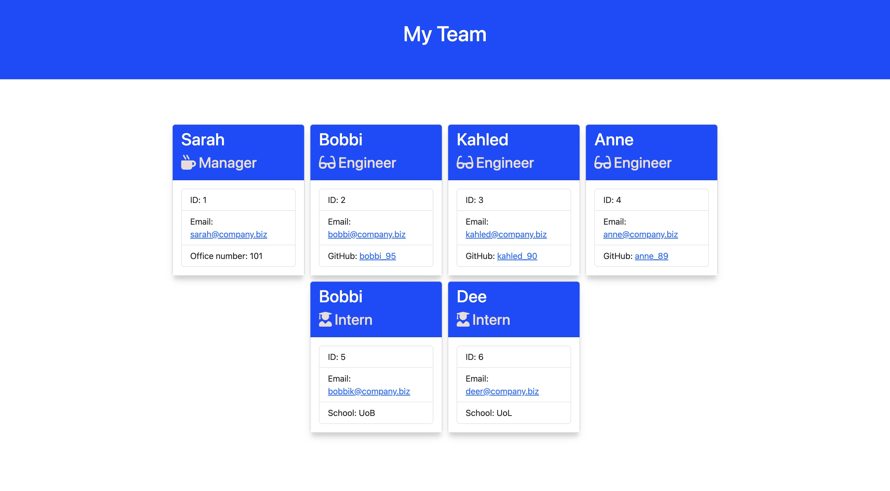

# Test-Driven-Development: Team Profile Generator (Module 12 Challenge)
My submission for the Module 12 Team Profile Generator challenge

## Description

This is my submission for the Module 12 Team Profile Generator challenge. The challenge required the development of a Node command-line app, which takes in user input (via the Inquirer NPM module), processes this data and outputs a fully-formed HTML document displaying an overview of the team members along with individual details.

Live example of a generated profile page:
https://jonathon10k.github.io/module12-generated-profile/team.html

## Installation

Please note that this app requires the use of Node.js to function. 
Further information on using Node.js, see: https://nodejs.org/en/learn/getting-started/introduction-to-nodejs

## Usage
Firstly, install necessary dependencies by typing 'npm i' in the terminal.
Launch index.js - using "node index.js" - and follow the text prompts. On completion, a HTML document will be generated within the 'output' folder.

## Credits

N/A

## License

N/A
